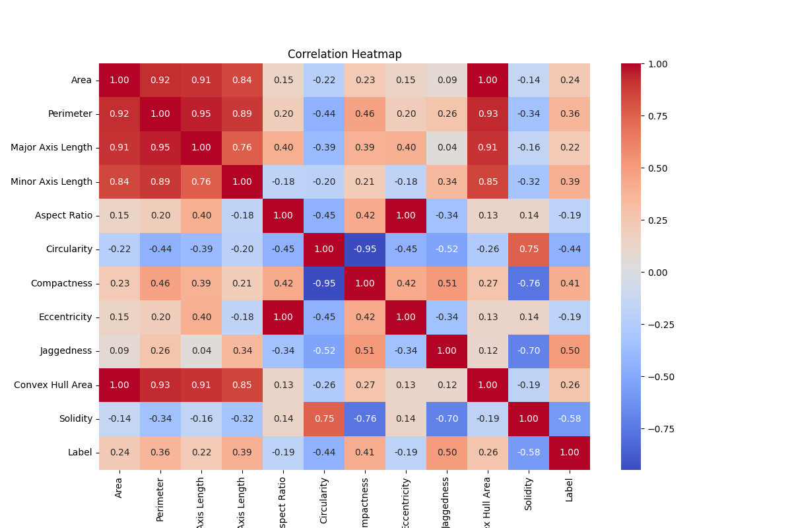

# Image Feature Extraction and Classification

This project extracts features from medical images, performs classification using several machine learning models, and visualizes important metrics and feature importance.

## Project Structure

- **main.py**: The main script to run the feature extraction, training, evaluation, and visualization.
- **requirements.txt**: The list of required Python packages.
- **masks/**: Directory containing the image masks.
- **meta/**: Directory containing the metadata files.

## Models Used

1. **XGBoost Classifier**
2. **Random Forest Classifier**
3. **Neural Network (MLP Classifier)**
4. **Stacking Classifier**

## Visualizations

1. **Correlation Heatmap**: Displays the correlation between different features.
   

2. **Feature Importance - Random Forest**
   

3. **Feature Importance - XGBoost**
   

4. **ROC Curve - Neural Network**
   

5. **ROC Curve - Random Forest**
   

6. **ROC Curve - Stacking Model**
   

7. **ROC Curve - XGBoost**
   

8. **Confusion Matrix for Top 3 Features**
   

## Setup and Installation

### Prerequisites

Ensure you have Python 3.x installed on your machine.

### Installation

1. Clone the repository:
    ```bash
    git clone <repository-url>
    cd <repository-directory>
    ```

2. Install the required Python packages:
    ```bash
    pip install -r requirements.txt
    ```

### Running the Project

1. Ensure that the `masks` and `meta` directories are in the same directory as `main.py`.
2. Run the `main.py` script:
    ```bash
    python main.py
    ```

## Features Extraction

The following features are extracted from each image:
- Area
- Perimeter
- Major Axis Length
- Minor Axis Length
- Aspect Ratio
- Circularity
- Compactness
- Eccentricity
- Jaggedness (Boundary Roughness)
- Convex Hull Area
- Solidity

## Model Training and Evaluation

1. **XGBoost Classifier**: Trained with Grid Search for hyperparameter tuning.
2. **Random Forest Classifier**: Trained with Grid Search for hyperparameter tuning.
3. **Neural Network (MLP Classifier)**: Trained with Grid Search for hyperparameter tuning.
4. **Stacking Classifier**: Combines the predictions of the above classifiers.

## Visualization

- **Correlation Heatmap**: Shows the correlation between different features.
- **Feature Importance**: Displays the importance of features as determined by the Random Forest and XGBoost models.
- **ROC Curves**: Plots the ROC curves for each model.
- **Confusion Matrix**: Shows the confusion matrix for the most important features.

## Acknowledgments

This project uses several open-source libraries including OpenCV, scikit-learn, XGBoost, and others for image processing, machine learning, and visualization.

Feel free to contribute to this project by submitting issues or pull requests.

---

Enjoy using the Image Feature Extraction and Classification project!
